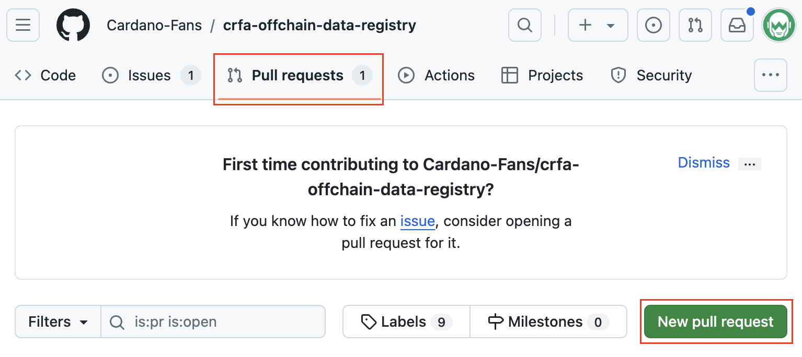

# Guide For Verifying Plutus script On Cardanoscan And Cexplorer

Cardanoscan and Cexplorer are leading blockchain explorers for Cardano. They offer a powerful toolset for users to explore, analyze, and verify transactions and smart contracts on the Cardano network.

In this guide, we will walk you through the process of verifying Plutus scripts. 
Verifying Plutus scripts on Cardano explorer allows users to access additional details about your contract, fostering transparency and building trust. 

This is what it looks like on:

- **Cexplorer**

    <p align="center"></p>

- **Cardanoscan**

    <p align="center"></p>

## CRF Offchain Data Registry

One way to verify your Plutus contract on Cardanoscan and Cexplorer is to add information about your contract to [crfa-offchain-data-registry](https://github.com/Cardano-Fans/crfa-offchain-data-registry). This registry is a centralized GitHub repository containing mappings of script hashes to decentralized apps.

For more details about the CRF Offchain Data Registry repository, check their README: https://github.com/Cardano-Fans/crfa-offchain-data-registry/blob/main/README.md

### Adding script in the CRF Offchain Data Registry

To add information about your Plutus contract to the registry you have to prepare your contract data in a special format and open a pull request in the CRF Offchain Data Registry repository. To do this, follow these steps:

1. **Fork the CRF Offchain Data Registry Repository**

    - Go to [the CRF Offchain Data Registry GitHub repository](https://github.com/Cardano-Fans/crfa-offchain-data-registry).
    - Click on the "Fork" button in the top right corner of the repository page.
        <p align="center"></p>
    - Confirm the fork creation.
        <p align="center"></p>

2. **Clone the CRF Offchain Data Registry repository**

    Use the `git clone` command to clone the forked repository on your machine. For example:

    ```console
    git clone https://github.com/WingRiders/crfa-offchain-data-registry.git
    cd ./crfa-offchain-data-registry
    ```

3. **Create a file for your project in dApps folder in the forked repository**

    All registered contracts are stored in [the dApps folder](https://github.com/Cardano-Fans/crfa-offchain-data-registry/tree/main/dApps) of the CRF Offchain Data Registry repository. This folder contains a file for each decentralized app or project.

    Add a new file to the directory called **{your-dapp-name}.json**.

    For example, you can do it by using the following command:

    ```console
    touch ./dApps/{your-dapp-name}.json
    ```

4. **Fill out your JSON file**

    Add all necessary information about your project and Plutus contracts in the created file. 

    Check the [DApp file structure](#dapp-file-structure) and [DApp file example](#dapp-file-example) sections for more details on how to populate the JSON file.

5. **Push your DApp file to your forked repository**

    You need to commit your changes and push them to the forked repository. To do this use the following commands:

    ```console
    git add ./dApps/{your-dapp-name}.json
    git commit -m "Add {your_project_name} contracts"
    git push
    ```

    Please note, that authentication may be required to push to GitHub.

6. **Go to your project on GitHub to create a pull request**

    Go to the forked repository on GitHub. On the repository page, go to the pull requests tab and click the "New pull request" button.

    <p align="center"></p>

7. **Provide a description for your PR**

    You will be redirected to the pull request creation page. On this page, you need to provide basic information about your project and your smart contracts. There is no strict template for creating PR.

8. **Submit PR**

    Click on the "Create pull request" button to complete the PR creation.

### DApp file structure

To register your project and your Plutus contracts you need to add a JSON file to the repository. This file must follow a specific structure.

You can find the JSON file structure in [the readme of the CRF Offchain Data Registry repository](https://github.com/Cardano-Fans/crfa-offchain-data-registry?tab=readme-ov-file#explanation-for-dapp-file).

The following table provides a description of the JSON fields.

|Name|Description|
|---|---|
|`id`| 8 random unique symbols that represent the ID of your dapp project.|
|`projectName`|Your project name.|
|`link`|A link to the main page of your project.|
|`twitter`|A link to the Twitter (X) page of your project.|
|`category`|A category of your project. </br> The field can take the following values: `DEFI`, `MARKETPLACE`, `COLLECTION`, `GAMING`, `COMMUNITY`, `TOKEN_DISTRIBUTION`.|
|`subCategory`|A subcategory of your project. </br> The field can take the following values: `AMM_DEX`, `ORDERBOOK_DEX`, `HYBRID_DEX`, `LENDING_BORROWING`, `NFT`, `ORACLE`, `WRAPPED_ASSETS`.|
|`description`|A JSON object representing a description of your project.|
|`description.short`|A short description of your project.|
|`releases`|A JSON array representing your smart contracts releases to the repository. </br> Each smart contract or batch of smart contracts is grouped by releases.|
|`releases.releaseNumber`|Your release number. The numbering starts from 1.|
|`releases.releaseName`|A name of the release. This can simply be a version number, for example `V1`, `V2`.|
|`releases.description`|A description of the release. This field is optional.|
|`releases.scripts`|A JSON array representing scripts in this particular release.|
|`releases.scripts.id`| 6 random unique symbols that represent the ID of the added script.|
|`releases.scripts.version`|The version of the added script. The numbering starts from 1.|
|`contracts`|A JSON array for information about the open source of your contracts.|
|`contracts.openSource`| A Boolean value indicating whether your contracts are open source. Set to `true` if yes, and `no` otherwise. |
|`contracts.contractLink`| A link to your open-source contract if any. |
|`contracts.contractId`|4 random unique symbols that represent the ID of your open-source contract.|
|`audits`|JSON array for information about audits. This field is optional|
|`audits.auditId`|4 random unique symbols that represent the ID of the audit author.|
|`audits.auditor`|The auditor company name.|
|`audits.auditLink`|A link to your audit report.|
|`audits.auditType`|An audit type. </br> The field can take the following values: `MANUAL`, `AUTOMATIC`. |
|`scripts`|A JSON array representing added scripts.|
|`scripts.id`|6 random unique symbols that represent the ID of the added script. They must match with the value you specified in the `releases.scripts.id` field.|
|`scripts.name`|A name of the added script.|
|`scripts.purpose`|A purpose of the added script. </br> The field can take the following values: `SPEND`, `MINT`. |
|`scripts.versions`|A JSON array representing versions of your script. </br> Each element of the array must correspond to one of the versions you specified in the `releases.scripts` field.|
|`scripts.versions.version`|One of the versions of the added script. It must match with the value you specified in the `releases.scripts.version` field.|
|`scripts.versions.plutusVersion`|Plutus language version of the script for this particular version. Specify only the number, for example `1` or `2`.|
|`scripts.versions.fullScriptHash`|A full hash of the Plutus script for this particular version. </br> You can provide prefix and script hash or script hash+staking key.|
|`scripts.versions.scriptHash`|A hash of your script for this particular version. </br> You can provide script hash or script hash+staking key.|
|`scripts.versions.contractAddress`|An address of your script for this particular version.|
|`scripts.versions.mintPolicyID`|Mint script policy id. Applicable only if you add mint script.|

### DApp file example

Under the spoiler, you will find a DAPP file for Wingriders contracts. This example includes two distinct releases and various contracts.

<details>
  <summary><b>Dapp file for Wingriders' contracts</b></summary>

```json
{
    "id": "CWpU1DBj",
    "projectName": "Wingriders",
    "link": "https://www.wingriders.com",
    "twitter": "https://twitter.com/wingriderscom",
    "category": "DEFI",
    "subCategory": "AMM_DEX",
    "description": {
        "short": "Native and fast AMM decentralized exchange platform on Cardano blockchain"
    },
    "features": [
        "SWAP",
        "LIQUIDITY_MINING",
        "ADA_STAKING",
        "YIELD_FARMING",
        "STABLESWAP",
        "LAUNCHPAD"
    ],
    "releases": [
        {
            "releaseNumber": 1,
            "releaseName": "V1",
            "scripts": [
                {
                    "id": "QPPiOs",
                    "version": 1
                }
            ]
        },
        {
            "releaseNumber": 2,
            "releaseName": "V2",
            "scripts": [
                {
                    "id": "d3DENr",
                    "version": 1
                },
                {
                    "id": "jSztuJ",
                    "version": 1
                },
                {
                    "id": "sWS42P",
                    "version": 1
                },
                {
                    "id": "tjt7ua",
                    "version": 1
                },
                {
                    "id": "QPPiOs",
                    "version": 2
                },
                {
                    "id": "0zi8YI",
                    "version": 1
                },
                {
                    "id": "Wts2nr",
                    "version": 1
                },
                {
                    "id": "mMZT4E",
                    "version": 1
                },
                {
                    "id": "jqh1iy",
                    "version": 1
                },
                {
                    "id": "a80Ji3",
                    "version": 1
                },
                {
                    "id": "A7WBK3",
                    "version": 1
                },
                {
                    "id": "f7c0LB",
                    "version": 1
                },
                {
                    "id": "f7c0LB",
                    "version": 2
                },
                {
                    "id": "f7c0LB",
                    "version": 3
                }
            ],
            "auditId": "9oS7"
        }
    ],
    "contracts": [
        {
            "openSource": false
        }
    ],
    "audits": [
        {
            "auditId": "9oS7",
            "auditor": "CertiK",
            "auditLink": "https://www.certik.com/projects/wingriders",
            "auditType": "MANUAL"
        }
    ],
    "scripts": [
        {
            "id": "d3DENr",
            "name": "Factory",
            "purpose": "SPEND",
            "type": "PLUTUS",
            "versions": [
                {
                    "version": 1,
                    "plutusVersion": 1,
                    "fullScriptHash": "71e9823c2d96ffc29ba6dd695fd85f784aa081bdcc01f92bb43242e752",
                    "scriptHash": "e9823c2d96ffc29ba6dd695fd85f784aa081bdcc01f92bb43242e752",
                    "contractAddress": "addr1w85cy0pdjmlu9xaxm454lkzl0p92pqdaesqlj2a5xfpww5s7evt7c"
                }
            ]
        },
        {
            "id": "jSztuJ",
            "name": "Pool payment credential",
            "purpose": "SPEND",
            "type": "PLUTUS",
            "versions": [
                {
                    "version": 1,
                    "plutusVersion": 1,
                    "fullScriptHash": "71e6c90a5923713af5786963dee0fdffd830ca7e0c86a041d9e5833e91",
                    "scriptHash": "e6c90a5923713af5786963dee0fdffd830ca7e0c86a041d9e5833e91",
                    "contractAddress": "addr1w8nvjzjeydcn4atcd93aac8allvrpjn7pjr2qsweukpnayghhwcpj"
                }
            ]
        },
        {
            "id": "sWS42P",
            "name": "Request",
            "purpose": "SPEND",
            "type": "PLUTUS",
            "versions": [
                {
                    "version": 1,
                    "plutusVersion": 1,
                    "fullScriptHash": "7186ae9eebd8b97944a45201e4aec1330a72291af2d071644bba015959",
                    "scriptHash": "86ae9eebd8b97944a45201e4aec1330a72291af2d071644bba015959",
                    "contractAddress": "addr1wxr2a8htmzuhj39y2gq7ftkpxv98y2g67tg8zezthgq4jkg0a4ul4"
                }
            ]
        },
        {
            "id": "tjt7ua",
            "name": "Vesting",
            "purpose": "SPEND",
            "type": "PLUTUS",
            "versions": [
                {
                    "version": 1,
                    "plutusVersion": 1,
                    "fullScriptHash": "710a27b0fb1daeb27ff58a79adcefc784fe5cfb5399750d3552e8c54f9",
                    "scriptHash": "0a27b0fb1daeb27ff58a79adcefc784fe5cfb5399750d3552e8c54f9",
                    "contractAddress": "addr1wy9z0v8mrkhtyll43fu6mnhu0p87tna48xt4p56496x9f7g940jft"
                }
            ]
        },
        {
            "id": "QPPiOs",
            "name": "Farm/Voting",
            "purpose": "SPEND",
            "type": "PLUTUS",
            "versions": [
                {
                    "version": 1,
                    "plutusVersion": 1,
                    "fullScriptHash": "719fd47e0d578fb539b9ec7e016dc5ee25844110a96712d55989b0751b",
                    "scriptHash": "9fd47e0d578fb539b9ec7e016dc5ee25844110a96712d55989b0751b",
                    "contractAddress": "addr1wx0aglsd278m2wdea3lqzmw9acjcgsgs49n3942e3xc82xcu406l6"
                },
                {
                    "version": 2,
                    "plutusVersion": 1,
                    "fullScriptHash": "710237cc313756ebb5bcfc2728f7bdc6a8047b471220a305aa373b278a",
                    "scriptHash": "0237cc313756ebb5bcfc2728f7bdc6a8047b471220a305aa373b278a",
                    "contractAddress": "addr1wypr0np3xatwhddulsnj3aaac65qg768zgs2xpd2xuaj0zscmvh0n"
                }
            ]
        },
        {
            "id": "0zi8YI",
            "name": "Factory/Liquidity token",
            "purpose": "MINT",
            "type": "PLUTUS",
            "versions": [
                {
                    "mintPolicyID": "026a18d04a0c642759bb3d83b12e3344894e5c1c7b2aeb1a2113a570",
                    "includeScriptBalanceFromAsset": "L",
                    "plutusVersion": 1,
                    "version": 1
                }
            ]
        },
        {
            "id": "Wts2nr",
            "purpose": "MINT",
            "type": "PLUTUS",
            "versions": [
                {
                    "mintPolicyID": "0ceaab7c2cec8f93c38b7c3598fa239f50bc14fcc6da9f016adb035c",
                    "plutusVersion": 1,
                    "version": 1
                }
            ]
        },
        {
            "id": "mMZT4E",
            "purpose": "MINT",
            "type": "PLUTUS",
            "versions": [
                {
                    "mintPolicyID": "980e8c567670d34d4ec13a0c3b6de6199f260ae5dc9dc9e867bc5c93",
                    "plutusVersion": 1,
                    "version": 1
                }
            ]
        },
        {
            "id": "jqh1iy",
            "name": "X Token",
            "purpose": "MINT",
            "type": "PLUTUS",
            "versions": [
                {
                    "mintPolicyID": "13e9940c94572eafef8b391b64b4a2e898b6a7008ece9064631e6fd2",
                    "plutusVersion": 1,
                    "version": 1
                }
            ]
        },
        {
            "id": "a80Ji3",
            "name": "Stableswap contract 1",
            "purpose": "SPEND",
            "type": "PLUTUS",
            "versions": [
                {
                    "version": 1,
                    "plutusVersion": 1,
                    "fullScriptHash": "71c5e0385012d5f010b1dc7ab42ba632944052de232051ec6ce3bfd72e",
                    "scriptHash": "c5e0385012d5f010b1dc7ab42ba632944052de232051ec6ce3bfd72e",
                    "contractAddress": "addr1w8z7qwzszt2lqy93m3atg2axx22yq5k7yvs9rmrvuwlawts2wzadz"
                }
            ]
        },
        {
            "id": "A7WBK3",
            "name": "Stableswap contract 2",
            "purpose": "SPEND",
            "type": "PLUTUS",
            "versions": [
                {
                    "version": 1,
                    "plutusVersion": 1,
                    "fullScriptHash": "719868d58fbfcc2b14cfc7d9eec0b765e7e6fc4e950c9c2748ace9ce61",
                    "scriptHash": "9868d58fbfcc2b14cfc7d9eec0b765e7e6fc4e950c9c2748ace9ce61",
                    "contractAddress": "addr1wxvx34v0hlxzk9x0clv7as9hvhn7dlzwj5xfcf6g4n5uucg4tkd7w"
                }
            ]
        },
        {
            "id": "f7c0LB",
            "name": "Launchpad",
            "purpose": "SPEND",
            "type": "PLUTUS",
            "contractLang": "PLUTARCH",
            "versions": [
                {
                    "version": 1,
                    "plutusVersion": 2,
                    "fullScriptHash": "716a6a56501ff2647758ec9d1f7d3efae1084188d76fe9061f9d9b43e4",
                    "scriptHash": "6a6a56501ff2647758ec9d1f7d3efae1084188d76fe9061f9d9b43e4",
                    "contractAddress": "addr1w94x54jsrlexga6cajw37lf7ltssssvg6ah7jpslnkd58eq6vc878"
                },
                {
                    "version": 2,
                    "plutusVersion": 2,
                    "fullScriptHash": "7192b489c6eb1186c8fd5d7ad1efb0b86eec61bf6e0d27b111a212a05d",
                    "scriptHash": "92b489c6eb1186c8fd5d7ad1efb0b86eec61bf6e0d27b111a212a05d",
                    "contractAddress": "addr1wxftfzwxavgcdj8at4adrmashphwccdldcxj0vg35gf2qhgmavq67"
                },
                {
                    "version": 3,
                    "plutusVersion": 2,
                    "fullScriptHash": "71c71e7c1fc483e897b1b0bfd0afc63204ca1a88701f55c371d117850e",
                    "scriptHash": "c71e7c1fc483e897b1b0bfd0afc63204ca1a88701f55c371d117850e",
                    "contractAddress": "addr1w8r3ulqlcjp739a3kzlapt7xxgzv5x5gwq04tsm36ytc2rs0vx42u"
                }
            ]
        }
    ]
}
```
