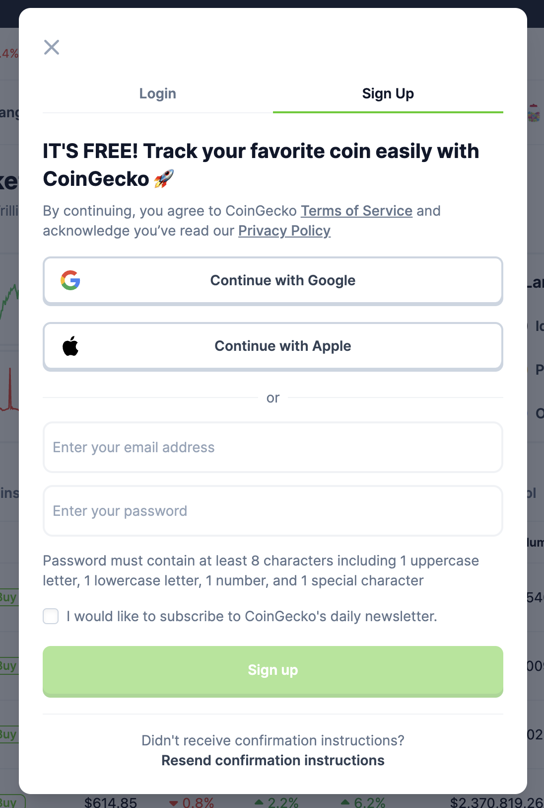
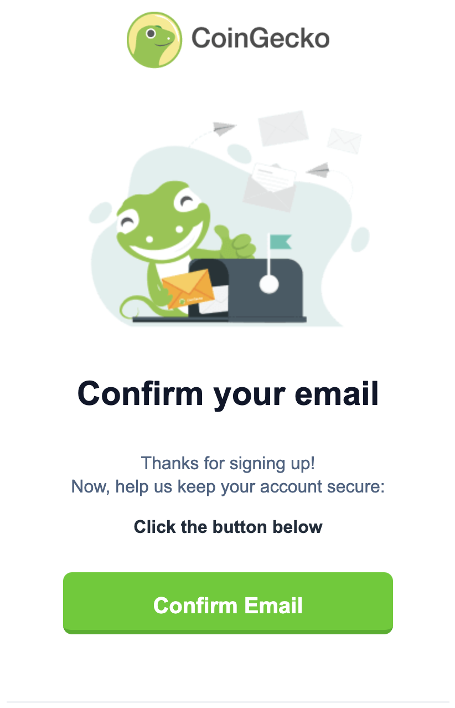

# Signing Up an Account on CoinGecko

This guide will walk you through the step-by-step process of signing up for an account on [CoinGecko](https://www.coingecko.com/).

Creating an account is a mandatory requirement to submit a request to add your crypto-asset or exchange.

## Registration process

The registration process is quite straightforward and standard:

1. **Visit the CoinGecko**

    Go to the official [CoinGecko](https://www.coingecko.com/) platform.

2. **Click on the "Sign Up" button**

    On the top right corner of the page, you will find the "Sign Up" button. Click on it.
    
    You should see the following window.

3. **Fill out the registration form or sign up with Google/Apple account**

    In this step, you can:
    
     - Fill out the registration form by entering your email and creating a password.
     - Click on "Continue with Google" or "Continue with Apple", if you would like to use your Google or Apple account.

4. **Check your email inbox to confirm your email address**
   
   After filling out all the required details, you will receive an email with a link to confirm your email address. 

    

 

    Click on the "Confirm Email" button.

After these steps, you will be redirected to the main page of the portal and you can begin registering your crypto-asset or exchange.
