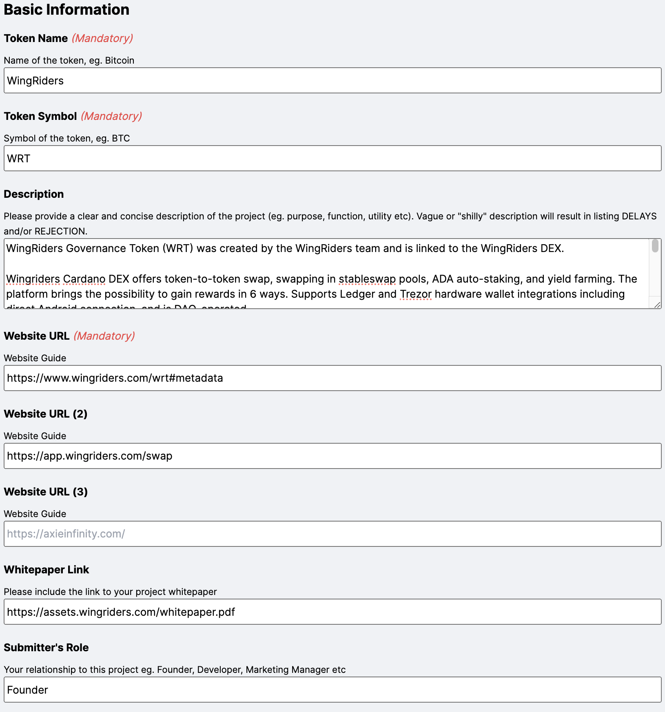
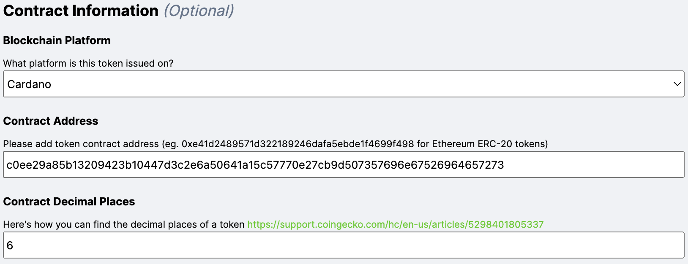

# Crypto-Asset Registration On CoinGecko

In this guide, we will provide you with detailed instructions, best practices, and information about the process of listing crypto-assets on CoinGecko.

The process of listing your crypto-asset on CoinGecko is quite simple and involves filling out an application form. In this guide, we will help you prepare all the necessary information, fill out the form correctly, and provide examples to make the registration process as simple and clear as possible.

## Prerequisites

Before you start filling out the form and submitting an application for listing a crypto-asset, we recommend checking the [Terms & Conditions for Listing on CoinGecko](https://www.coingecko.com/en/listing_terms) and the ["How to list new cryptocurrencies on CoinGecko?](https://support.coingecko.com/hc/en-us/articles/7291312302617-How-to-list-new-cryptocurrencies-on-CoinGecko) guide created by the CoinGecko team.

CoinGecko supports fetching circulating and total supply via an API endpoint. This will allow CoinGecko to automatically update your supply information. If you would like to use this option, please check [the CoinGecko Integration Ideal API Endpoints document](https://docs.google.com/document/d/1v27QFoQq1SKT3Priq3aqPgB70Xd_PnDzbOCiuoCyixw/edit#heading=h.pydh6ytf8qyc).

To successfully apply to add a new crypto-asset, you will need to provide the information about your crypto-asset, developer team, social and media. You can check what information is required in the following table.

| Name | Status | Description |
|---|---|---|
| Token Name | Mandatory | Name of your crypto-asset. |
| Token Symbol | Mandatory | Symbol or ticker related to your crypto-asset. |
| Description | Optional | Description of your crypto-asset project. |
| Website URL | Mandatory | Link to your project website. |
| Whitepaper Link | Optional | Link to your whitepaper (a document that summarizes the information on your project). |
| Exchange Trading Information | Optional | Links to exchanges where your crypto-asset can be exchanged. |
| Blockchain Platform | Optional | Blockchain platform you used. |
| Contract Address | Optional | Address of your smart contract for crypto-asset. |
| Contract Decimal Places | Optional | Number of decimal places in your crypto-asset. |
| Block Explorer Links | Optional | Links to your crypto-asset smart contracts in block explorers. |
| Total Supply | Optional | Total amount of tokens that have been minted. |
| Max Supply | Optional | Maximum amount of tokens that can be minted. |
| Community Information | Optional | Links to your pages and channel on Twitter (X), Telegram, Facebook, YouTube, etc. |
| Developer Information | Optional | Links to your accounts on GitHub, GitLab, Bitbucket. |
| Token Image | Optional | Image of your crypto-asset in PNG or JPG format with a transparent background and size 200x200. |

As you can see in this table, most of the fields are optional. However, **all fields are recommended to be filled out if possible.**

## Access to the crypto-asset registration form

The crypto-asset registration form on CoinGecko can be found at the following link: https://www.coingecko.com/request-form. However, we advise you to follow [the Crypto-asset registration section of the general CoinGecko guide](./README.md#crypto-asset-registration) to get to this page as a result of filling out the Google form.

As a result of following the link, you should see the following page.

<p align="center"></p>

Click on the "Token" section to get access to the application form for listing a new crypto-asset (in this guide, we will consider registering only a crypto-asset that was created on a smart contract platform).

## Filling out the registration form

Let's look at filling out all sections of the application form.

1. **Basic information**

    In this section, you should provide basic information about your crypto-asset, such as:

    - Token Name
    - Token Symbol
    - Description
    - Website URL
    - Whitepaper Link
    - Submitter's Role

    Example of filling out the "Basic information" section for WingRiders Governance Token.

    <p align="center"></p>

2. **Exchange Trading Information**

    In the "Exchange Trading Information" section, you need to provide links to the trading platforms or exchanges where your crypto asset is listed.

    For example,

    ```
    https://app.wingriders.com/pools/026a18d04a0c642759bb3d83b12e3344894e5c1c7b2aeb1a2113a570dec347c549f618e80d97682b5b4c6985256503bbb3f3955831f5679cdb8de72f,
    https://app.wingriders.com/pools/026a18d04a0c642759bb3d83b12e3344894e5c1c7b2aeb1a2113a570abc456f205c642b9488a91b0a543becbd542fa71f957d5a96baa3b03a70aa9f0,
    https://www.gate.io/ru/trade/WRT_USDT
    ```

3. **Block Explorer Links**

    In this section, provide links to a smart contract responsible for your crypto-asset in block explorers.

    For example, the following links could be provided for the WingRiders Governance Token:

    ```
    https://cardanoscan.io/token/c0ee29a85b13209423b10447d3c2e6a50641a15c57770e27cb9d507357696e67526964657273
    https://cexplorer.io/asset/asset18v68f0vgv2nc3at8cuuem7f3fztwqcq2usgjyp
    ```

4. **Contract Information**

    In this section, you need to provide information about the smart contract you are using for your crypto-asset. You need to specify the following information:

    - Blockchain Platform
    - Contract Address
    - Contract Decimal Places

    You can specify several blockchain platforms if you issue your token on several at once.

    Example of filling out the "Contract Information" section for WingRiders Governance Token.

    <p align="center"></p>

5. **Token Supply Details**

    In this section, you need to provide information about your total supply.
    
    In the “Token Supply” field, you should indicate the exact number of melted tokens or check the box if it is infinite.
    
    In the "Max Supply” field, you should indicate the maximum amount of tokens that can be minted or check the box if it is infinite.

6. **Community Information**

    In the "Community Information" section, you can provide links to your project's social networks, media and channels.

7. **Developer Information**

    In the "Developer Information" section, you can specify links to your company/project pages on GitHub, GitLab or Bitbucket.

8. **Addition information**

    In the "Any other info that you would like to share with the CoinGecko team?" field, you can provide any information about your project that you find useful. Here you can indicate some features or achievements of the project that were not mentioned or provide some proof of the above information so that the CoinGecko team can quickly verify your application. 

9.  **Attachments**

    In the "Attachments" section you can upload the logo of your crypto-asset. The image should meet the following  requirements:

    - size 200x200 pixels
    - transparent background
    - PNG or JPG format

10. **Final checkboxes**
        
    Before submitting the form you have to check the boxes:

    - Listing Terms
    - Support Terms
    - Accuracy Declaration
    - Public Verification Post
  
    Please carefully read the description of the checkboxes on CoinGecko and check that you agree with them.

    Note that by checking the "Public Verification Post" box, you agree to make a post on your project account on one of your social networks in which you have to include the request ID number and GeckoTerminal URL. This is important so that the CoinGecko team can make sure that you are an official representative of the team.

After filling in the form, carefully review the provided information and click the **Submit** button.
