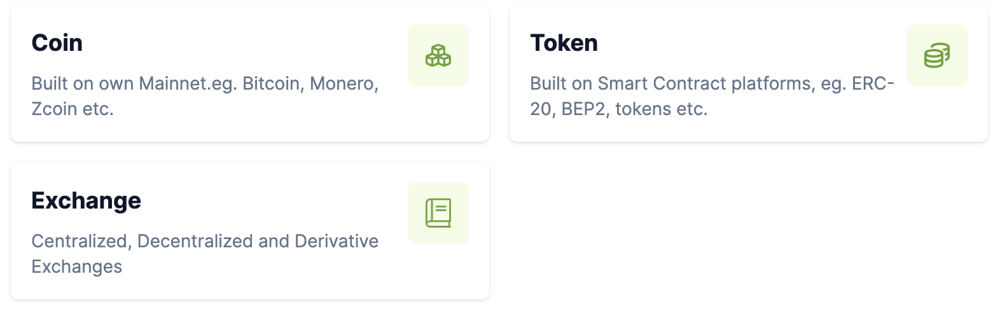
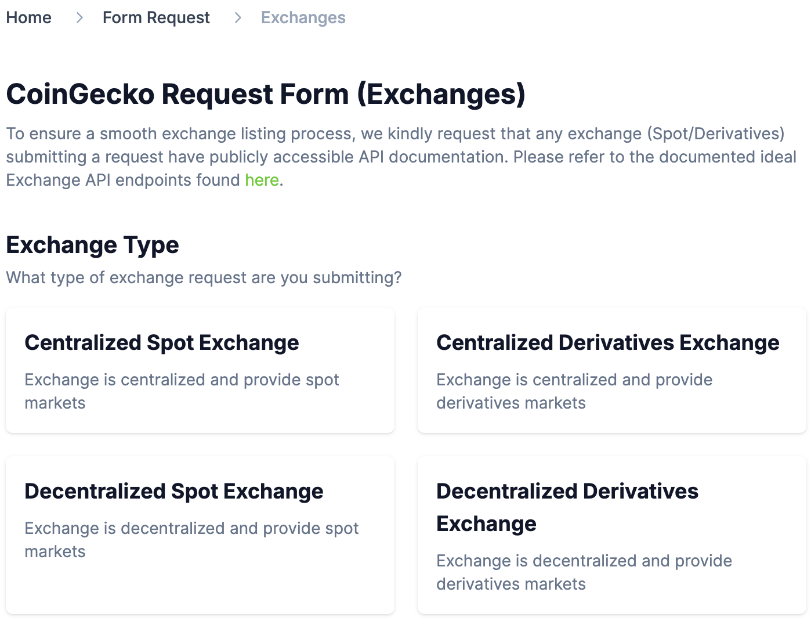

# Exchange Registration On CoinGecko

In this guide, we will provide you with detailed instructions, best practices, and information about the process of listing exchanges on CoinGecko.

The process of listing your exchange on CoinGecko involves filling out an application form. In this guide, we will help you prepare all the necessary information, fill out the form correctly, and provide examples to make the registration process as simple and clear as possible.

## Prerequisites

Before you start filling out the form and submitting an application for listing an exchange, we recommend checking the [Terms & Conditions for Listing on CoinGecko](https://www.coingecko.com/en/listing_terms) and the ["How do I add a new exchange?](https://support.coingecko.com/hc/en-us/articles/4497658821273-How-do-I-add-a-new-exchange) guide created by the CoinGecko team.

To integrate your exchange with CoinGecko you have to implement certain API endpoints. All API endpoint requirements and specifications can be found in [the CoinGecko Integration Ideal API Endpoints document](https://docs.google.com/document/d/1v27QFoQq1SKT3Priq3aqPgB70Xd_PnDzbOCiuoCyixw/edit). **Please read this document carefully and implement the required endpoints for your exchange before filling out the application form.**

To successfully apply to add a new exchange, you will need to provide the information about your exchange, developer team, social and media. You can check what information is required in the following table.

| Name | Status | Description |
|---|---|---|
| Exchange Name | Mandatory | Name of your exchange. |
| Website URL | Mandatory | Link to your exchange platform. |
| API Documentation | Mandatory | Link to the API documentation in [this format](https://docs.google.com/document/d/1z74UdDBbTVQA5ETXyAprx3Bx5iLlNEbC02VyoSrEUOg/edit).|
| Description | Optional | Description of your exchange. |
| Regulatory License | Optional | Link to your regulatory license if any. |
| Customer Support Email | Optional | Email address of your customer support service. |
| Year of Establishment | Mandatory | Year when your exchange was launched. |
| Supported Countries | Optional | List of countries that your exchange supports. |
| Country of Incorporation | Mandatory | Country where your exchange or developer team is registered. |
| Company Address | Optional | The address of your company's head office. |
| Fees Information | Mandatory | Information about fees on your exchange, if any. |
| Fiat Support | Mandatory | Information about which fiat currencies your exchange supports. |
| Community Information | Optional | Links to your pages and channel on Twitter (X), Telegram, Facebook, YouTube, etc. |
| Contract Information | Mandatory | Addresses of smart contracts that you used in the exchange. |
| Exchange Logo | Optional | Logo of your exchange in PNG or JPG format with a transparent background and size 200x200. |

As you can see in this table, most of the fields are optional. However, **all fields are recommended to be filled out if possible.**

## Access to the exchange registration form

The exchange registration form on CoinGecko can be found at the following link: https://www.coingecko.com/request-form. However, we advise you to follow [the Crypto-asset and exchange registration section of the general CoinGecko guide](./README.md#crypto-asset-and-exchange-registration) to get to this page as a result of filling out the Google form.

As a result of following the link, you should see the following page.

<p align="center"></p>

Click on the "Exchange" section. Next, you will be taken to a page where you need to select the type of your exchange.

<p align="center"></p>

Select the appropriate exchange type. The application form is the same for all types of exchanges.

## Filling out the registration form

Let's look at filling out all fields of the application form.

1. **Exchange Name**

    Specify the name of your exchange project. For example:

    ```
    WingRiders
    ```

2. **Exchange Website URL**

    Provide a URL link to your exchange. For example:

    ```
    https://app.wingriders.com/
    ```

3. **Submitter's Role**

    Specify your relationship to this project. For example:

    ```
    Developer
    ```

4. **API Documentation URL**

    To integrate with CoinGecko you need to create certain API-endpoints. You can check CoinGecko API requirements in [this document](https://docs.google.com/document/d/1v27QFoQq1SKT3Priq3aqPgB70Xd_PnDzbOCiuoCyixw/edit).

    In the field, provide a URL link to a Google document with your project's API documentation. The document must be publicly available and follow [this format](https://docs.google.com/document/d/1z74UdDBbTVQA5ETXyAprx3Bx5iLlNEbC02VyoSrEUOg/edit). 

5. **Coins/Markets Info Page**

    Provide a URL link to the page of your exchange that contains 24-hour trading volume, price for each pair, and open interest for derivatives. For example:

    ```
    https://app.wingriders.com/pools/
    ```

6. **Exchange Description**

    This is an optional field where you can provide a description of your exchange.

7. **List(s) of Regulatory License(s) Obtained, with verifiable links**

    If your exchange has regulatory licenses, provide links to them in this field. Links must be to a reliable source so that the CoinGecko team can verify the provided information.

8. **Customer Support Email**

    Indicate your exchange's customer support email, if available. Leave the field blank in case you don't have one.

9.  **Year of Establishment**

    Specify the year when your exchange was launched.

10. **Supported or Unsupported Countries**

    Provide a list of countries that your exchange supports or doesn't support. You can use one of the formulations:

    - `All except [list unsupported countries]`
    - `Only [list supported countries]`

11. **Country of Incorporation**

    Select the country of registration of your exchange or your development team from the drop-down list.

12. **Exchange Company Address**

    In this optional field, you can enter the address of your company's headquarters.

13. **Team's Info Availability**

    Select "Yes" or "No" depending on whether information about your exchange development team is available.

14. **Public Team Profile page link**

    Provide a link to your team's profile page if you have one.

15. **Fees Information**

    The application form contains several fields in which you must provide information about the fees on your exchange:

    - **Market with Fees**. Select "Yes" if there are any trading, withdrawal, or deposit fees in your exchange, or "No" otherwise.
    - **Fees URL**. Provide a URL link to the page where you describe the fee structure on your platform.
    - **Trading Fees**. Specify trading fees on your platform.
    - **Withdrawal Fees**. Specify withdrawal fees on your platform.
    - **Deposit Fees**. Specify deposit fees on your platform.

16. **List of Accepted Fiat Currencies**

    List the fiat currencies that your exchange supports. Enter "None" if your exchange does not accept fiat currency.

17. **Accepted Payment Method**

    Provide available payment methods on your exchange, if applicable.

18. **Margin Trading**

    Select "Yes" or "No" depending on whether your exchange supports margin trading.

19. **Social, Media and Community Information**

    The application form contains several fields in which you should provide links to your social networks, media platforms or channels. Please provide this information for all platforms you use.

20. **Telegram Handle**

    Provide your Telegram handle as an alternative communication method for the CoinGecko team. 

21. **Would you be able to provide backlinks to CoinGecko?**

    In the "Would you be able to provide backlinks to CoinGecko?" field, select "yes" if you are willing to include backlinks to CoinGecko from your website or platform.

    Backlink is a type of hyperlink that passes Search Engine Optimization (SEO) authority or "link juice" from the referring page to the linked page. Providing backlinks means you agree to link back to CoinGecko's website from your official website or platform. By agreeing to provide backlinks to CoinGecko, you are helping to improve the visibility and SEO ranking of CoinGecko, which can be beneficial for both sides.

22. **Contract Specification Information**

    Please provide a URL link to the page describing your derivatives contract. This field is applicable only to derivatives exchanges.

23. **Blockchain Platform**

    In the drop-down list, select a used blockchain platform, e.g. "Cardano". This field is only applicable to DEXes.

24. **Is the project a fork?**

    If your project is a fork of another project, you must indicate this in this field. The field is only applicable for decentralized spot exchanges.

25. **Router Address**

    In this field, enter your router contract address if you are registering a decentralized spot exchange. For example:

    ```
    addr1wxr2a8htmzuhj39y2gq7ftkpxv98y2g67tg8zezthgq4jkg0a4ul4
    ```

26. **Factory Address**

    In this field, enter your factory contract address if you are registering a decentralized spot exchange. For example:

    ```
    addr1w85cy0pdjmlu9xaxm454lkzl0p92pqdaesqlj2a5xfpww5s7evt7c
    ```

27. **Exchange Logo**

    In the "Exchange Logo" field you should upload the logo of your exchange. The image should meet the following  requirements:

    - size 200x200 pixels
    - transparent background
    - PNG or JPG format

28. **Remarks**

    In the "Remarks" field, you can provide any information about your project that you find useful. Here you can indicate some features or achievements of the project that were not mentioned or provide some proof of the above information so that the CoinGecko team can quickly verify your application.

29. **Final checkboxes**
        
    Before submitting the form you have to check the boxes:

    - Listing Terms
    - Support Terms
    - Accuracy Declaration
  
    Please carefully read the description of the checkboxes on CoinGecko and check that you agree with them.

After filling in the form, carefully review the provided information and the click **Submit** button.
