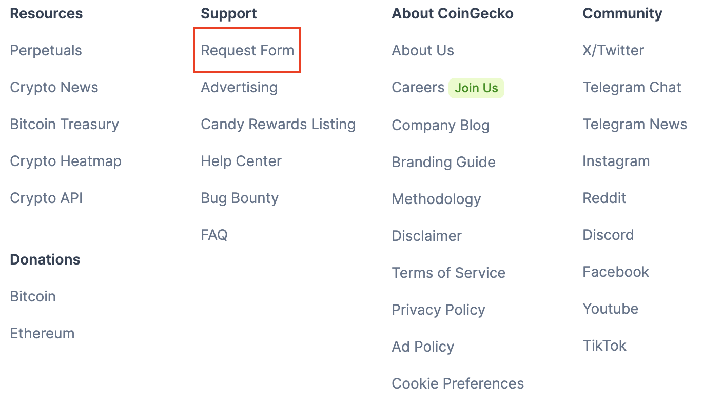
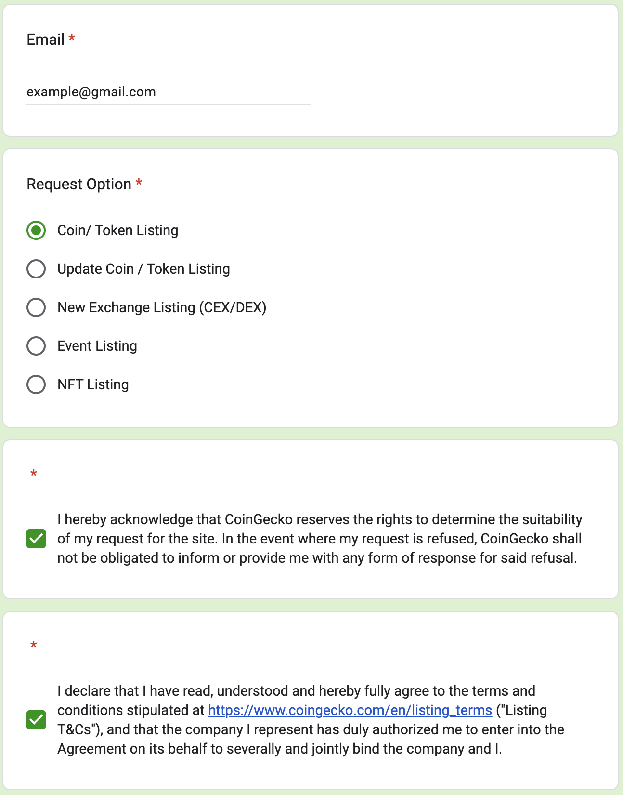

# CoinGecko Registration Guide

[CoinGecko](https://www.coingecko.com/) stands as a leading cryptocurrency data aggregator, offering users comprehensive insights into thousands of digital assets and exchanges. By registering and listing your crypto-asset or exchange on CoinGecko, you will gain access to a vast audience of investors, traders, and enthusiasts, enhancing your project's exposure and credibility in the crypto community.

In this guide, we will guide you through the step-by-step process of creating a CoinGecko account, followed by detailed instructions to list your crypto-asset or exchange. We'll cover essential aspects such as preparing the necessary information, meeting CoinGecko's listing criteria, and navigating the submission process to ensure a seamless and successful listing experience.

## Creating an account on CoinGecko

The first step to listing your crypto-asset or exchange on [CoinGecko](https://www.coingecko.com/) is to create an account on their platform. Registering a CoinGecko account is a necessary and not complicated process.

Follow [the Account Registration Page](./AccountRegistration.md) for more details on how to create an account on CoinGecko.

## Crypto-asset and exchange registration

In order to list your crypto-asset or exchange on the CoinGecko platform, you need to log into your CoinGecko account and submit an application form.

To apply to list your crypto-asset or exchange, you need

1. **Click "Request Form" on the main page CoinGecko platform**

    Scroll down the main page of [CoinGecko](https://www.coingecko.com/) and in the "Support" column click on the "Request Form" link.

    

 

2. **Fill out the Google Form**

    You will be redirected to a Google form. This form is needed to notify the CoinGecko team of your intention to register a crypto-asset or an exchange. Fill out all form fields:

    - *Email*. Specify your email address.
    - *Request Option*. Select "Coin / Token Listing" or "New Exchange Listing (CEX/DEX)" option.
    - Read and agree with the terms and conditions.

    

 

    After filling out the form, click the "Next" button.

3. **Follow the link to fill out the asset-adding application form**

   After you click the "Next" button, you will be taken to the next Google Form page. On this page, you will find a link to the application form. Follow it.

4. **Fill out and submit an application form for adding your crypto-asset or exchange**

    You will be redirected to CoinGecko and will be able to apply a form for listing your crypto-asset or exchange.

    

 

    To get more instructions on filling out the form, check:
    - [Asset Registration page](./AssetRegistration.md)
    - [Exchange Registration page](./ExchangeRegistration.md)
   
5. **Submit the Google form you filled out earlier**

    When you fill out and submit the application form on CoinGecko, click "Submit" in the Google Form to complete the application process.

## Approval Process

After submitting the registration form, wait for the CoinGecko team to review and approve your submission. You can check the status of your submission in [the My Requests page on CoinGecko](https://www.coingecko.com/request-form/submissions).

The review process for a submission on CoinGecko can vary in duration. It usually takes 5-7 working days. The exact time can depend on various factors, including the volume of submissions, the completeness and accuracy of the information provided, and the verification of the details.
