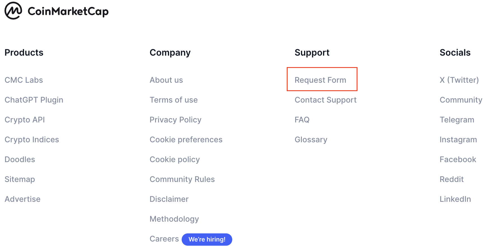
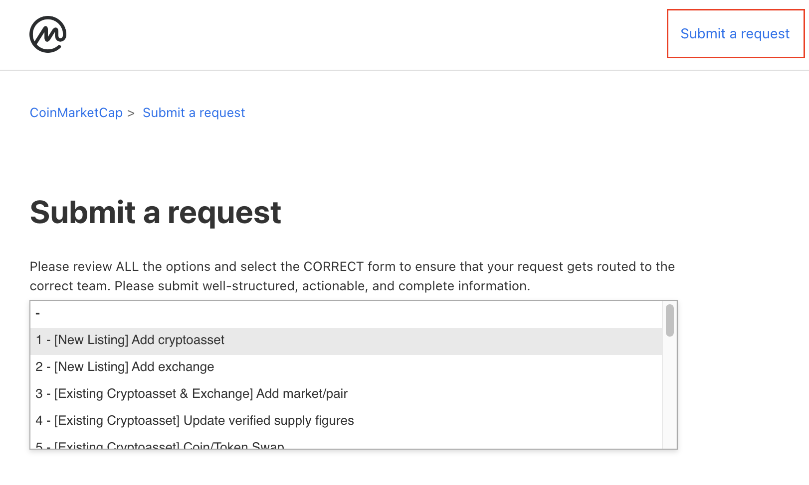
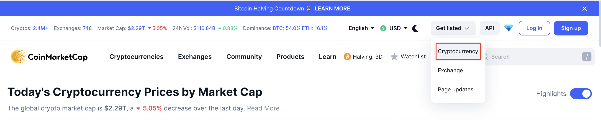

# CoinMarketCap Registration Guide

CoinMarketCap is one of the most popular and widely used platforms for tracking and comparing the performance of cryptocurrencies and exchanges. Being listed on CoinMarketCap can significantly increase the visibility and credibility of your project or exchange in the crypto community.

This comprehensive guide is designed to walk you through the registration process step by step, providing detailed instructions and explanations for each field and requirement you'll encounter during the registration process. Whether you're a cryptocurrency project looking to register a new token or an exchange seeking to list your trading pairs, this guide will help you navigate the registration process smoothly and efficiently.

From creating an account on the CoinMarketCap Support platform to filling out the detailed registration form and providing the necessary documentation and information, this guide covers everything you need to know to successfully register your project or exchange on CoinMarketCap.

## Creating an account on CoinMarketCap

First of all, to register your crypto-asset on CoinMarketCap (CMC) you need to create an account at https://support.coinmarketcap.com/. This CoinMarketCap Support platform is used to create registration and update requests for token assets and exchanges. You can find the support platform by clicking the "Request Form" link at the bottom of the [CoinMarketCap page](https://coinmarketcap.com/).

Check the [Support Platform Registration page](./SupportPlatformRegistration.md) for details on creating an account.

## Crypto-asset registration

After registration, you can apply to list your crypto-asset on CoinMarketCap. To do this you need to fill out a special form, which can be accessed in one of two ways.

- Log in on the [CoinMarketCap Support platform](https://support.coinmarketcap.com/), click the "Submit a request" button and find in the drop-down list the "Add cryptoasset" option.

- Go on [CoinMarketCap website](https://coinmarketcap.com/), click the "Get listed" button in the top-right corner and select "Cryptocurrency" option.

Detailed instructions for filling out the form for adding a new crypto-asset can be found on the [Asset Registration page](./AssetRegistration.md).

## Approval Process

After submitting the registration form, wait for the CoinMarketCap team to review and approve your submission. 

The review process for a submission on CoinMarketCap can vary in duration. Generally, it may take several days to a few weeks for CoinMarketCap to review and process it. The exact time can depend on various factors, including the volume of submissions, the completeness and accuracy of the information provided, and the verification of the details.
