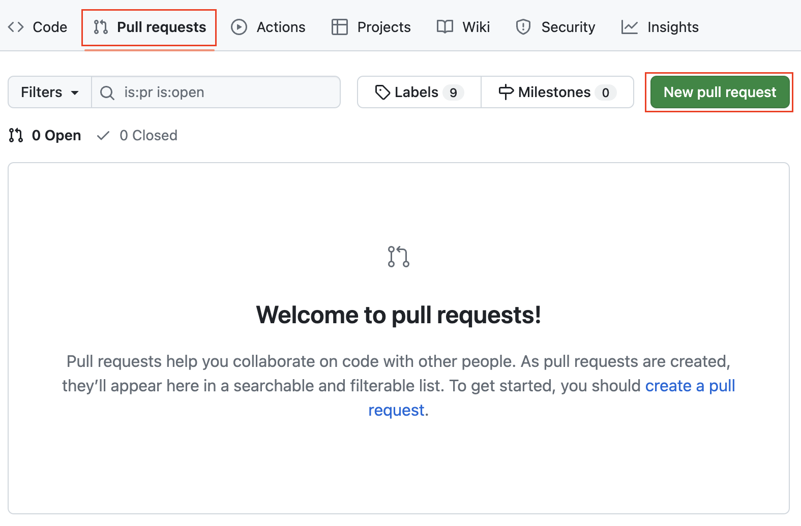

# DeFiLlama DEX Adapter Registration Guide

The process of listing your DEX on DeFiLlama involves implementing and publishing the DEX dimension-adapter. In this guide, we will provide you with detailed instructions, best practices, and information about the process of registering your DEX dimension-adapter on DeFiLama.

## Prerequisites

Before creating your adapter, we recommend reading the ["Listing your project"](https://docs.llama.fi/list-your-project/other-dashboards/listing-your-project) page on DeFiLlama and making sure that you have everything you need to implement the adapter.

List of prerequisites:

- Account on GitHub
- Basic JavaScript knowledge to implement a DEX adapter
- Installed `yarn` on your machine

## Forking the DeFiLlama Repository

The first step is to fork [the DeFiLlama dimension-adapters repository](https://github.com/DefiLlama/dimension-adapters) on GitHub to create your own copy of the repository.

1. **Go to the DeFiLlama dimension-adapters repository**

    Go to the DeFiLlama dimension-adapters repository on GitHub: https://github.com/DefiLlama/dimension-adapters

2. **Click on the "Fork" button**

    Click on the "Fork" button in the top right corner of the repository page.

    <p align="center"></p>

3. **Confirm the fork creation**

    You will be redirected to the background creation page on GitHub. Check the name and description of the fork you are creating. Click on the "Create fork" button to confirm the fork creation.

    <p align="center"></p>

The creation of the fork is completed and you can start implementing your own DEX dimension-adapter.

## Creating DEX dimension-adapter

The next step is to implement your DEX dimension-adapter within the forked repository. This involves coding a script that fetches and calculates the volume of your DEX.

### Initializing DEX dimension-adapter

After you have created a fork of the repository, you need to prepare a directory for implementing the adapter.

1. **Clone the DeFiLlama dimension-adapters repository**

    Use the `git clone` command to clone the forked repository on your machine.

    ```console
    git clone {link-to-your-forked-repository}
    cd ./dimension-adapters
    ```

2. **Add a new folder to projects**

    In the repository, add a new folder with the same name as the project to the `dexs` folder:

    ```console
    mkdir ./dexs/wingriders/
    ```

3. **Add index.js file in your project folder.**

    In your project folder, create an empty file `index.js`:

    ```console
    touch ./dexs/wingriders/index.js
    ```

### Implementing DEX dimension-adapter

Now you can start implementing your DEX dimension-adapter. The adapter is a script in JavaScript that fetches data and calculates the volume of your DEX.

You can find a description of the dimension-adapter implementation in [the "How to build an adapter" guide](https://docs.llama.fi/list-your-project/other-dashboards/how-to-build-an-adapter) created by the DeFiLlama team.

In this section, we will look at the implementation of WingRiders DEX dimension-adapter. Check the following code:

```javascript
import { Adapter, ChainBlocks, FetchOptions } from "../../adapters/types"
import { CHAIN } from "../../helpers/chains";
import { httpPost } from "../../utils/fetchURL";

const volUrl = 'https://aggregator.mainnet.wingriders.com/volumeInAda';

async function fetchVolume(timestamp: number , _: ChainBlocks, { createBalances }: FetchOptions) {
    const dailyVolume = createBalances()
    const last24hVolInAda = await httpPost(volUrl, { "lastNHours": 24 });
    dailyVolume.addGasToken(last24hVolInAda * 1e6);
    return {
        dailyVolume,
        timestamp
    }
}

export default {
    adapter: {
        [CHAIN.CARDANO]: {
            fetch: fetchVolume,
            runAtCurrTime: true,
            start: 0,
        }
    }
} as Adapter
```

The adapter consists of 3 main sections:

1. **Dependencies**

    In the WingRiders TVL adapter, we use dependencies for importing:
    
    - `Adapter`, `ChainBlocks`, `FetchOptions` types to define and implement a fetch function
    - `CHAIN` constant for using it in the export section
    - `httpPost` function for making HTTP calls
    
    In your adapter, you can use other dependencies that already exist in the project. Moreover, DeFiLlama provides its own functions to help you implement your adapter. You can check them out on [this page](https://docs.llama.fi/list-your-project/other-dashboards/helper-functions).

2. **Functions for fetching and calculating volume**

    In the example, we implement the `fetchVolume` function that makes an HTTP call to the WingRiders API endpoint to fetch the volume for the last 24 hours and add this volume to the balances.

    Please note, that all calculations in the adapter must be done in protocol currency (like ADA for Cardano) and include all the decimals. All subsequent conversions to USD and calculation of the volume in the DEX will be carried out by the DeFiLlama SDK.

3. **Module exports**

    The last part of the implementation is the adapter export. In the WingRiders DEX dimension-adapter, we export an object:

    ```javascript
    adapter: {
        [CHAIN.CARDANO]: {
            fetch: fetchVolume,
            runAtCurrTime: true,
            start: 0,
        }
    }
    ```

    A description of all fields for DEX dimension-adapters can be found in [the DeFiLlama documentation](https://docs.llama.fi/list-your-project/other-dashboards/how-to-build-an-adapter#baseadapter).

    In the example:

    - `fetch` is a function that returns different dimensions of a protocol.
    - `runAtCurrTime` is set to `true` because the adapter takes into account the timestamp and block passed to the fetch function.
    - `start` is the earliest timestamp that can be passed to the fetch function.

### Testing DEX dimension-adapter

To test your adapter, go to the repository directory and follow these steps.

1. **Initialize npm**

    Run command `yarn` to install dependencies and initialize a project.

2. **Run tests**

    To run tests, use the command:

    ```console
    yarn test dexs {your_project} [timestamp]
    ```

    Timestamp is an option parameter.

If the adapter runs successfully, the console will show your DEX daily volume. For the WingRiders DEX dimension-adapter, it looks like:

```console
🦙 Running WINGRIDERS adapter 🦙
_______________________________________
CARDANO 👇
Backfill start time not defined
NO METHODOLOGY SPECIFIED
Daily volume: 173.27 k
Timestamp: 1714175999 (2024-04-26T23:59:59.000Z)

✨  Done in 3.22s.
```

Carefully check your values and if they look accurate, you're ready to create a pull request.

## Creating pull request

After you implement and test your adapter you can create a pull request.
To create a pull request, follow these steps:

1. **Push the adapter to your forked repository**

    First of all, you need to commit your changes and push them to the forked repository. To do this use the following commands:

    ```console
    git commit -m "Add {your_project_name} dimension-adapter"
    git push
    ```

    Please note, that authentication may be required to push to GitHub.

2. **Go to your project on GitHub to create a pull request**

    Go to the forked repository on GitHub. On the repository page, go to the pull requests tab and click the "New pull request" button.

    <p align="center"></p>

3. **Provide a description for your PR**

    You will be redirected to the pull request creation page. On this page, you need to provide basic information about your project and the implemented adapter. There is no strict template for creating PR.  

4. **Submit PR**

    Click on the "Create pull request" button to complete the PR creation.

## Approval process

After PR creation, you don't need to ask for someone to check your PR as they are monitored regularly. Someone from the DeFiLlama team will check your PR and merge it or leave a comment if something was done wrong.

Once your PR has been merged, the DeFiLlama team will load your listing onto the UI within 24 hours.
