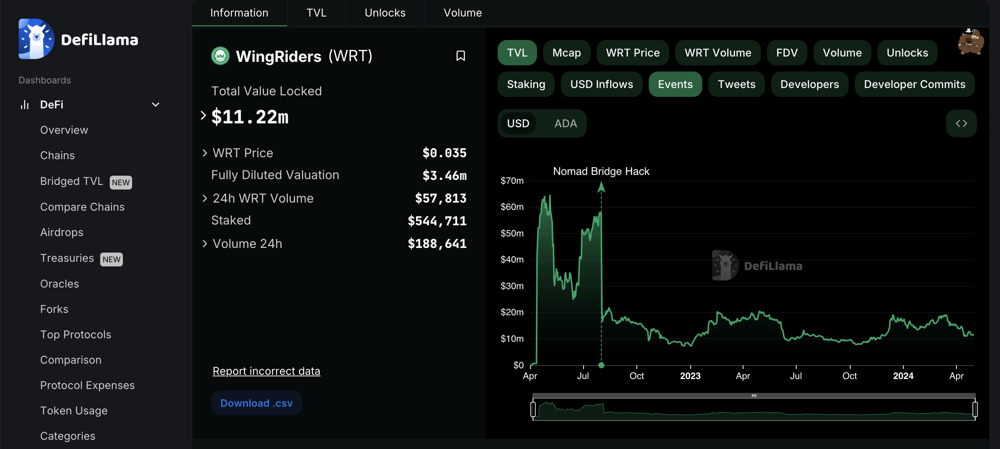

# DeFiLlama Registration Guide

[DeFiLlama](https://defillama.com/) is a leading analytics platform that serves as a comprehensive dashboard for tracking the total value locked (TVL) across a wide range of DeFi protocols. This real-time data aggregation offers users valuable insights into the performance, trends, and popularity of various DeFi projects, allowing them to make informed investment decisions. In addition to tracking TVL, DeFiLlama provides detailed information on protocol integrations, governance tokens, and yield farming opportunities, making it an ideal tool for those looking to navigate the complex DeFi ecosystem.

In this guide, we'll guide you through the step-by-step process of listing your DeFi project on DeFiLlama. We'll cover essential aspects such as implementing and publishing your TVL adapter in the DeFiLlama repository, adding your decentralized exchange on DeFiLlama, and ensuring your project meets the platform's listing requirements.

## Creating an adapter for proving TVL

DeFiLlama aggregates data only from open-source protocols. Therefore, the listing process on DeFiLame is different from other tracking platforms.

To list your project and provide your TVL on DeFiLlama, you need to implement a TVL adapter. This involves coding a script that fetches and calculates the TVL of your project's protocol or platform. Once implemented, the adapter needs to be published in the DeFiLlama repository to make it accessible to the platform.

Check [the TVL Adapter Registration page](./TvlAdapaterRegistration.md) for detailed instructions.

## Creating an adapter for providing DEX volume

To list your DEX on DeFiLlama, you need to implement a DEX dimension-adapter. This involves coding a script that fetches and calculates the volume of your DEX. Once implemented, the adapter needs to be published in the DeFiLlama repository to make it accessible to the platform.

Check [the DEX Adapter Registration page](./DexAdapaterRegistration.md) for detailed instructions.
