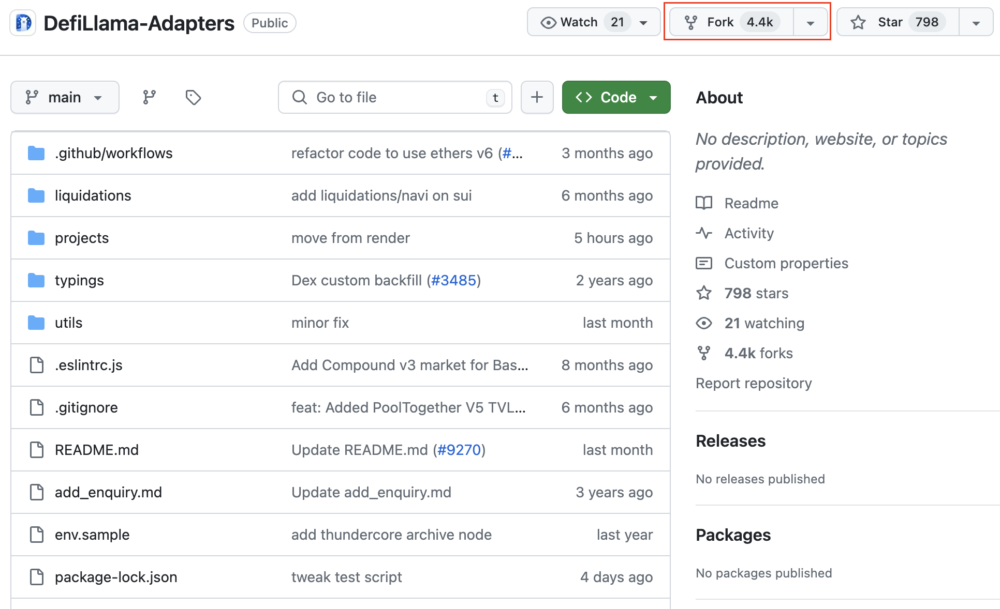
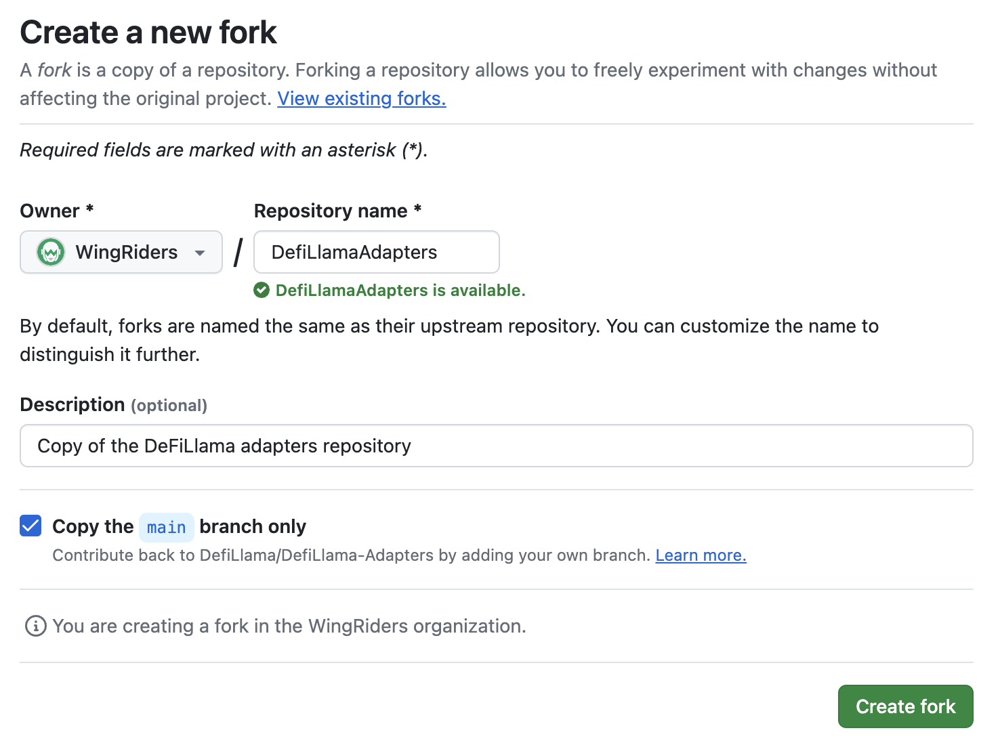
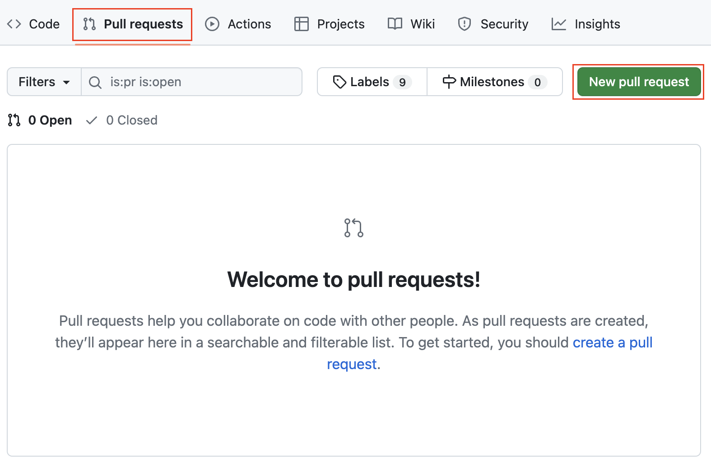

# DeFiLlama TVL Adapter Registration Guide

The process of listing your project on DeFiLlama involves implementing and publishing a TVL adapter. In this guide, we will provide you with detailed instructions, best practices, and information about the process of registering your TVL adapter on DeFiLama

## Prerequisites

Before creating your adapter, we recommend reading the ["How to list a DeFi project"](https://docs.llama.fi/list-your-project/submit-a-project) page on DeFiLlama and making sure that you have everything you need to implement the adapter.

List of prerequisites:

- Account on GitHub
- Basic JavaScript knowledge to implement a TVL adapter
- Installed `npm` on your machine
- Information about your project, team, social and media for filling out [the PR template](https://github.com/DefiLlama/DefiLlama-Adapters/blob/main/pull_request_template.md).

## Forking the DeFiLlama Repository

The first step is to fork [the DeFiLlama adapters repository](https://github.com/DefiLlama/DefiLlama-Adapters) on GitHub to create your own copy of the repository.

1. **Go to the DeFiLlama adapters repository**

    Follow the DeFiLlama adapters repository on GitHub: https://github.com/DefiLlama/DefiLlama-Adapters

2. **Click on the "Fork" button**

    Click on the "Fork" button in the top right corner of the repository page.

    <p align="center"></p>

3. **Confirm the fork creation**

    You will be redirected to the background creation page on GitHub. Check the name and description of the fork you are creating. Click on the "Create fork" button to confirm the fork creation.

    <p align="center"></p>

The creation of the fork is completed and you can start implementing your own TVL adapter.

## Creating TVL adapter

The next step is to implement your TVL adapter within the forked repository. This involves coding a script that fetches and calculates the TVL of your project's protocol or platform.

### Initializing TVL adapter

After you have created a fork of the repository, you need to prepare a directory for implementing the adapter.

1. **Clone the DeFiLlama adapters repository**

    Use the `git clone` command to clone the forked repository on your machine.

    Example commands for cloning the forked DeFiLlama adapters repository in the WinRiders organization:

    ```console
    git clone https://github.com/WingRiders/DefiLlama-Adapters.git
    cd ./DefiLlama-Adapters 
    ```

2. **Add a new folder to projects**

    In the repository, add a new folder with the same name as the project to the `projects` folder:

    ```console
    mkdir ./projects/wingriders
    ```

3. **Add index.js file in your project folder.**

    In your project folder, create an empty file `index.js`:

    ```console
    touch ./projects/wingriders/index.js
    ```

### Implementing TVL adapter

Now you can start implementing your TVL adapter. The TVL adapter is a script in JavaScript that fetches data and calculates TVL on your project.

You can find a detailed description of the TVL adapter implementation in [the "How to write an SDK adapter" guide](https://docs.llama.fi/list-your-project/how-to-write-an-sdk-adapter) created by the DeFiLlama team.

In this section, we will look at the implementation of a TVL adapter using WingRiders as an example. Check the following code:

```javascript
const axios = require("axios");

const headers = {
  "Accept-Encoding": "gzip, deflate, br",
};

/** @returns {Promise<{tvl: string, staking: string}>} */
async function getTvlBreakdown() {
    const res = await axios.post(
        'https://api.mainnet.wingriders.com/graphql',
        {
            query: '{tvlBreakdown {tvl, staking}}'
        },
        { headers }
    )
    return res.data.data.tvlBreakdown
}

async function tvl() {
  const tvlBreakdown = await getTvlBreakdown()
  return {cardano: Number(tvlBreakdown.tvl)}
}

async function staking() {
  const tvlBreakdown = await getTvlBreakdown()
  return {cardano: Number(tvlBreakdown.staking)}
}

module.exports = {
  timetravel: false,
  cardano: {
    tvl,
    staking,
  },
  hallmarks: [
    [1659312000,"Nomad Bridge Hack"]
  ],
};
```

The adapter consists of 3 main sections:

1. **Dependencies**

    In the WingRiders TVL adapter, we use only the "axios" dependency for making HTTP calls. In your adapter, you can use other dependencies that already exist in the project. Moreover, DeFiLlama provides its own functions to help you implement your adapter. You can check them out on [this page](https://docs.llama.fi/list-your-project/functions-weve-written-so-you-dont-have-to).

2. **Functions for calculating TVL**

    In the example, we implement three functions:

    - `getTvlBreakdown` - function makes GraphQL query to WingRiders API and fetches TVL and staking data.
    - `tvl` - function returns TVL in ADA of WingRiders DEX
    - `staking` - function returns the staking value in ADA in WingRiders DEX

    Please note, that all functions in the adapter must return values in protocol currency (like ADA for Cardano) and include all the decimals. All subsequent conversions to USD and calculation of TVL on the blockchain will be carried out by the DeFiLlama SDK.

3. **Module exports**

    The last part of the adapter is module exports. DeFiLlama uses data from module exports to display your data in their UI.

    In the WingRiders TVL adapter, there are 3 fields in `module.exports` module:

    - `timetravel`. This field should be set to `true` if it's possible to backfill data with your adapter. It's not possible for the WingRiders adapter, so this value is set to `false`.
    - `cardano`. This field contains an object with functions that provide data about your TVL and staking value on Cardano.
    - `hallmarks`. This field contains a set of events that greatly affected protocol TVL and should be displayed on the chart. You can check how the "Nomad Bridge Hack" is displayed on [the WingRiders dashboard](https://defillama.com/protocol/wingriders). 

### Testing TVL adapter

To test your adapter, go to the repository directory and follow these steps.

1. **Initialize npm**

    Run command:

    ```console
    npm install
    ```

2. **Enable debug mode**

    Enable debug mode using the following export command:

    ```console
    export LLAMA_DEBUG_MODE="true" 
    ```

3. **Run tests**

    To run tests, use the command:

    ```console
    node test.js projects/{your_project}/index.js`.
    ```

If the adapter runs successfully, the console will show you a breakdown of your project's TVL in USD.

Here's a breakdown of the WingRiders' TVL:

```console
--- cardano ---
ADA                       10.75 M
Total: 10.75 M 

--- cardano-staking ---
ADA                       548.45 k
Total: 548.45 k 

--- tvl ---
ADA                       10.75 M
Total: 10.75 M 

--- staking ---
ADA                       548.45 k
Total: 548.45 k 

------ TVL ------
cardano                   10.75 M
cardano-staking           548.45 k
staking                   548.45 k

total                    10.75 M 
```

In the console output, the implemented adapter returns that WingRiders' total TVL is $10.75M, which is the correct value.

Carefully check your values and if they look accurate, you're ready to create a pull request.

## Creating pull request

After you implement and test your adapter you can create a pull request.
To create a pull request, follow these steps:

1. **Push the adapter to your forked repository**

    First of all, you need to commit your changes and push them to the forked repository. To do this use the following commands:

    ```console
    git commit -m "Add {your_project_name} adapter"
    git push
    ```

    Please note, that authentication may be required to push to GitHub.

2. **Go to your project on GitHub to create a pull request**

    Go to the forked repository on GitHub. On the repository page, go to the pull requests tab and click the "New pull request" button.


    <p align="center"></p>

3. **Fill out the PR template**

    You will be redirected to the pull request creation page. On this page, you need to fill out [the PR template](https://github.com/DefiLlama/DefiLlama-Adapters/blob/main/pull_request_template.md). The PR template includes information about your project, team and social media platforms. This information will be used on your DeFiLlama dashboard.

4. **Submit PR**

    Click on the "Create pull request" button to complete the PR creation.

## Approval process

After PR creation, you don't need to ask for someone to check your PR as they are monitored regularly. Someone from the DeFiLlama team will check your PR and merge it or leave a comment if something was done wrong..

Once your PR has been merged, the DeFiLlama team will load your listing onto the UI within 24 hours.
